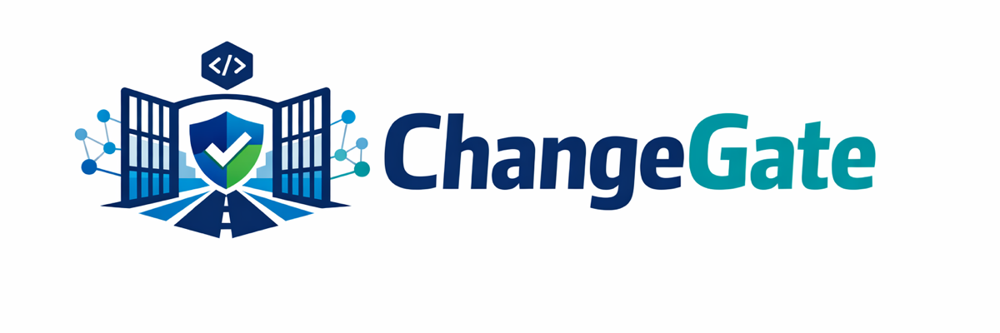
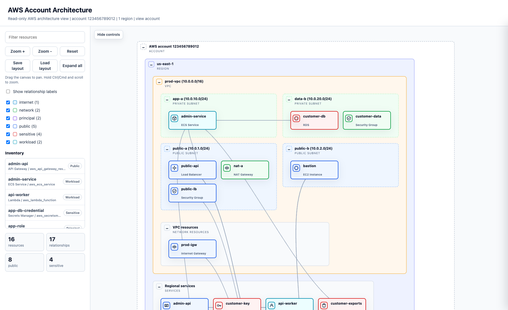

<p align="center">
  
</p>

# ChangeGate

[](https://github.com/Gabriel0110/changegate/actions/workflows/ci.yml)
[](https://github.com/Gabriel0110/changegate/actions/workflows/security.yml)

ChangeGate is a fast, graph-aware Terraform/OpenTofu risk gate for CI/CD. It reads the plan that is actually about to apply, builds a graph of changing infrastructure, and returns one deployment decision: `ALLOW`, `WARN`, or `BLOCK`.

Use it when you want fewer noisy scanner findings and more trusted deploy decisions.

```bash
terraform plan -out=tfplan
terraform show -json tfplan > tfplan.json
changegate scan --plan tfplan.json
```

By default, ChangeGate runs offline from plan JSON. It does not require a SaaS account, cloud credentials, telemetry, or an AI decision-maker.

## Why ChangeGate

Most IaC scanners inspect source files and produce checklists. ChangeGate gates the planned change.

| ChangeGate focuses on    | Why it matters                                                                                              |
| ------------------------ | ----------------------------------------------------------------------------------------------------------- |
| Plan-aware analysis      | Evaluates the resources and actions Terraform/OpenTofu is about to apply.                                   |
| Graph-aware risk         | Understands relationships between load balancers, security groups, IAM, compute, networks, and data stores. |
| High-confidence blocking | Blocks only risks that meet policy, severity, confidence, and context thresholds.                           |
| One deploy decision      | Produces a deterministic allow/warn/block result for CI.                                                    |
| Governed exceptions      | Supports expiring waivers and baselines for existing debt.                                                  |
| Evidence-rich output     | Emits findings with evidence, graph paths, remediation, fingerprints, and audit bundles.                    |

## Features

- **Plan-aware deployment gating:** evaluates Terraform/OpenTofu plan JSON and returns one CI-friendly deploy decision.
- **Blast-radius graph:** maps changing resources to public entrypoints, IAM edges, networks, workloads, and sensitive assets.
- **Attack-path evidence:** highlights deterministic public-to-sensitive-data and IAM privilege-escalation paths.
- **Review Intelligence:** generates security impact statements, PR/MR comments, GitHub annotations, GitLab Code Quality output, and visual graph artifacts.
- **AWS architecture visualization:** turns read-only AWS context snapshots into self-contained account, network, public-exposure, data, IAM, compute, and resource diagrams.
- **Governed adoption:** supports baselines, new-risk-only mode, expiring waivers, audit bundles, and stable finding fingerprints.
- **External scanner imports:** ingests SARIF, Checkov, Trivy, KICS, Grype, and generic JSON findings for graph-aware correlation.
- **Optional cloud context:** collects redacted AWS read-only snapshots while keeping normal scans offline and credential-free.
- **Module risk tests:** write regression tests for infrastructure modules and expected ChangeGate decisions.
- **Portable distribution:** ships a single binary plus release archives, checksums, SBOMs, signed artifacts, Docker images, Linux packages, and an npm installer package.

## Review Intelligence

ChangeGate includes review-oriented commands for pull requests, merge requests, approval workflows, and module regression tests:

```bash
changegate impact --plan tfplan.json --format markdown
changegate graph path --plan tfplan.json --from aws_lb.admin --to aws_db_instance.customer
changegate graph exposure --plan tfplan.json --resource aws_ecs_service.admin
changegate graph visualize --plan tfplan.json --view exposure --resource aws_ecs_service.admin --out exposure.html
changegate attack-paths --plan tfplan.json --to-sensitive-data
changegate attack-paths visualize --plan tfplan.json --out attack-paths.html
changegate review github --report changegate.json --comment --annotations
changegate review gitlab --report changegate.json --comment
changegate context aws snapshot --out .changegate/aws-context.json --collect=all
changegate architecture aws visualize --context-file .changegate/aws-context.json --view account --out aws-architecture.html
changegate test examples/risk-tests
```

These commands reuse the same deterministic scan engine and graph model. The default path remains local and credential-free; AWS cloud context is opt-in and produces redacted offline snapshots. See [Review Intelligence](docs/review-intelligence.md), [Security Impact Statement](docs/security-impact-statement.md), [Blast-Radius Graph](docs/graph.md), [AWS Architecture Visualization](docs/aws-architecture.md), and [Attack Paths](docs/attack-paths.md).

## AWS Architecture Visualization

Use a redacted AWS context snapshot to generate a self-contained architecture map without running a scan. The default account map focuses on deployed resources, not IAM policy internals or individual AWS API action nodes:

```bash
changegate context aws snapshot --collect=network,edge,compute,data,iam --out .changegate/aws-context.json
changegate architecture aws visualize --context-file .changegate/aws-context.json --view account --out aws-architecture.html
```

Or collect read-only AWS inventory and render in one command:

```bash
changegate architecture aws visualize --regions us-east-1 --view account --out aws-architecture.html
```

Live AWS collection uses the standard AWS SDK credential chain. Use a read-only AWS role or profile for context collection:

```bash
changegate architecture aws visualize --profile readonly --regions us-east-1 --out aws-architecture.html
```

Scope live snapshots or diagrams to tagged resources when you want a team-specific view:

```bash
changegate context aws snapshot --collect=all --regions us-east-1 --tag team=payments --out .changegate/payments-context.json
changegate architecture aws visualize --regions us-east-1 --tag team=payments --out payments-architecture.html
```



The HTML viewer includes account, region, VPC, subnet, service, and resource grouping; search and role filters; collapsible containers; draggable resources; edge highlighting; a minimap; saved browser layouts; and a right-side resource inspector. IAM detail is available through the IAM view without expanding every granted AWS API action into the main architecture map. See [AWS architecture visualization](docs/aws-architecture.md) and [Cloud Context](docs/cloud-context.md#live-aws-collection).

## What It Catches

The built-in AWS rule pack currently includes 63 stable high-confidence rules, including:

- public administrative services and database exposure
- world-open security group ingress on admin, database, and all-port ranges
- production RDS replacement, backup reduction, disabled final snapshots, disabled backups, and disabled deletion protection
- DynamoDB PITR, S3 versioning/logging, CloudTrail, AWS Config, and ECR production guardrails
- public S3 policies and ACLs, public Lambda function URLs, public admin API Gateway routes, and weak public load balancer listeners
- broad IAM admin, NotAction, sensitive wildcard access, PassRole, assume-role, KMS decrypt, and Secrets Manager read paths
- public-to-sensitive datastore graph paths
- sensitive storage without encryption, logging, or versioning
- public subnet, EFS, ElastiCache, private subnet, and transit/peering blast-radius expansion

See the [rule reference](docs/rules/README.md) for the full list.

## Install

Release install:

```bash
export CHANGEGATE_VERSION=vX.Y.Z
# Requires cosign on PATH for signed checksum verification.
curl -fsSL "https://raw.githubusercontent.com/Gabriel0110/changegate/${CHANGEGATE_VERSION}/scripts/install.sh" | bash
```

The installer verifies the signed checksum manifest with `cosign`, verifies the archive checksum, and refuses mismatches. Set `CHANGEGATE_VERIFY_SIG=false` only in trusted test environments where signature verification is intentionally unavailable. Set `CHANGEGATE_VERSION` to another release tag when upgrading. Release artifacts include checksums, signed checksums, SBOMs, attestations, signed Docker images, and Linux `.deb`, `.rpm`, and `.apk` packages.

Docker:

```bash
docker run --rm ghcr.io/gabriel0110/changegate:vX.Y.Z version
docker run --rm -v "$PWD:/work:ro" ghcr.io/gabriel0110/changegate:vX.Y.Z scan --plan /work/tfplan.json
```

Published image tags include `vX.Y.Z`, `X.Y.Z`, `X.Y`, `X`, and `latest`.

npm:

```bash
npx changegate version
npx changegate scan --plan tfplan.json
```

The npm package installs the matching platform binary from GitHub Releases, verifies the signed checksum manifest with `cosign`, and verifies the archive checksum before extraction. Set `CHANGEGATE_NPM_VERIFY_SIG=false` only in trusted test environments.

See [Install Options](docs/distribution.md) for Docker tags and npm installer behavior.

Development build:

```bash
go build -o bin/changegate ./cmd/changegate
bin/changegate version
```

## Quickstart

Terraform:

```bash
terraform init
terraform plan -out=tfplan
terraform show -json tfplan > tfplan.json
changegate scan --plan tfplan.json
```

OpenTofu:

```bash
tofu init
tofu plan -out=tfplan
tofu show -json tfplan > tfplan.json
changegate scan --plan tfplan.json
```

Exit codes are stable:

| Exit code | Meaning                           |
| --------- | --------------------------------- |
| `0`       | Deployment is allowed.            |
| `1`       | ChangeGate found a blocking risk. |
| `2`       | Usage or flag error.              |
| `3`       | Input parsing error.              |
| `4`       | Policy/configuration error.       |
| `5`       | Cloud-context error.              |
| `6`       | Internal error.                   |
| `7`       | Unsupported input or provider.    |

## Repository Setup

Use `changegate init` when you want ChangeGate to create starter files for a repository instead of wiring everything by hand:

```bash
changegate init --dry-run
changegate init --github-actions --audit-mode
```

The initializer writes safe audit-mode defaults so you can collect signal before enforcing block decisions. It never overwrites existing files unless `--force` is passed.

Common options:

| Option             | Creates                                                                                                            |
| ------------------ | ------------------------------------------------------------------------------------------------------------------ |
| `--github-actions` | `.github/workflows/changegate.yml` with audit-mode scan, PR review comment, SARIF upload, and audit bundle upload. |
| `--gitlab-ci`      | `.gitlab-ci.yml` with audit-mode scan, GitLab Code Quality output, MR note, and audit bundle artifact.             |
| `--baseline`       | `.changegate/README.md` with baseline creation commands for existing-risk adoption.                                |
| `--waivers`        | `.changegate/waivers.yaml` starter file for governed exceptions.                                                   |
| `--audit-mode`     | `.changegate.yaml` configured for evidence collection before enforcement.                                          |
| `--dir PATH`       | Writes starter files into a specific repository directory.                                                         |
| `--force`          | Allows overwriting generated files after review.                                                                   |

Typical rollout:

```bash
changegate init --github-actions --baseline --waivers --audit-mode
```

After reviewing the generated files, commit them with your Terraform/OpenTofu root conventions and adjust paths as needed.

## Output Formats

Use console output locally:

```bash
changegate scan --plan tfplan.json
```

Generate machine-readable output:

```bash
changegate scan --plan tfplan.json --format json --out changegate.json
changegate scan --plan tfplan.json --format sarif --out changegate.sarif
changegate scan --plan tfplan.json --format markdown --out changegate.md
changegate graph path --plan tfplan.json --from aws_lb.admin --to aws_db_instance.customer --format mermaid --out graph-path.mmd
changegate graph export --plan tfplan.json --format dot --out graph.dot
```

Generate visual review artifacts:

```bash
changegate graph visualize --plan tfplan.json --out graph.html
changegate graph visualize --plan tfplan.json --view path --from aws_lb.admin --to aws_db_instance.customer --out path.html
changegate attack-paths visualize --plan tfplan.json --out attack-paths.html
changegate architecture aws visualize --context-file .changegate/aws-context.json --view account --out aws-architecture.html
changegate architecture aws visualize --context-file .changegate/aws-context.json --view public-exposure --out public-exposure.html
changegate architecture aws diff --before-context-file old-context.json --after-context-file new-context.json
changegate graph render --plan tfplan.json --view exposure --resource aws_ecs_service.admin --render-format svg --out exposure.svg
```

Architecture maps are self-contained HTML files with search, role filters, a resource inventory, collapsible containers, draggable resources and containers, connected-edge highlighting, a minimap, saved browser layouts, and a right-side resource inspector.

Archive audit evidence:

```bash
changegate scan --plan tfplan.json --audit-bundle changegate-audit.zip
```

See [output formats](docs/output-formats.md) and [audit evidence](docs/audit-compliance.md).

## External Scanner Imports

ChangeGate can ingest findings from other scanners and normalize them into the same decision, waiver, baseline, graph-correlation, and output model as native findings. Keep tools like Checkov, Trivy, KICS, Grype, and SARIF-producing scanners while using ChangeGate as the deployment risk gate.

```bash
changegate scan --plan tfplan.json --import-sarif checkov.sarif
changegate scan --plan tfplan.json --import-checkov checkov.json
changegate scan --plan tfplan.json --import-trivy trivy.json
changegate scan --plan tfplan.json --import-kics kics.json
changegate scan --plan tfplan.json --import-grype grype.json
```

ChangeGate does not install or run external scanners. It reads existing JSON or SARIF artifacts, deduplicates repeated findings, correlates imported findings to changed graph resources where possible, and keeps native ChangeGate findings authoritative when richer graph evidence exists.

See [external scanner adapters](docs/adapters.md).

## GitHub Actions

```yaml
name: infrastructure-risk

on:
  pull_request:
    paths:
      - "infra/**"

permissions:
  contents: read
  security-events: write

jobs:
  changegate:
    runs-on: ubuntu-latest
    steps:
      - uses: actions/checkout@de0fac2e4500dabe0009e67214ff5f5447ce83dd # v6.0.2
      - uses: hashicorp/setup-terraform@v3
      - uses: sigstore/cosign-installer@6f9f17788090df1f26f669e9d70d6ae9567deba6 # v4.1.2

      - name: Terraform plan
        working-directory: infra
        run: |
          terraform init
          terraform plan -out=tfplan
          terraform show -json tfplan > tfplan.json

      - name: Install ChangeGate
        env:
          CHANGEGATE_VERSION: vX.Y.Z
          CHANGEGATE_INSTALL_DIR: ${{ runner.temp }}/changegate-bin
        run: |
          curl -fsSL "https://raw.githubusercontent.com/Gabriel0110/changegate/${CHANGEGATE_VERSION}/scripts/install.sh" -o /tmp/install-changegate.sh
          bash /tmp/install-changegate.sh
          echo "${CHANGEGATE_INSTALL_DIR}" >> "${GITHUB_PATH}"

      - name: ChangeGate scan
        id: changegate
        working-directory: infra
        run: |
          status=0
          changegate scan --plan tfplan.json --format sarif --out changegate.sarif || status=$?
          changegate scan --plan tfplan.json --format github-step-summary --out "$GITHUB_STEP_SUMMARY" || true
          echo "exit_code=$status" >> "$GITHUB_OUTPUT"

      - name: Upload SARIF
        if: always()
        uses: github/codeql-action/upload-sarif@4c50b6f6fd9dc6fe03111c2d045c8be2a724cce1 # v3.28.11
        with:
          sarif_file: infra/changegate.sarif

      - name: Enforce ChangeGate decision
        if: always() && steps.changegate.outputs.exit_code != '0'
        run: exit "${{ steps.changegate.outputs.exit_code }}"
```

See [GitHub Actions](docs/github-actions.md), [GitLab CI](docs/gitlab-ci.md), [Atlantis](docs/atlantis.md), and [Terraform Cloud/Enterprise](docs/terraform-cloud.md).

## Risk Tests

Define deterministic risk test manifests for Terraform/OpenTofu module fixtures and run them with `changegate test`. Risk tests assert ChangeGate decisions, required or forbidden findings, attack paths, graph paths, risk movement, waiver state, and stable output snapshots. See [risk tests](docs/risk-tests.md).

ChangeGate also includes a sanitized example corpus that doubles as executable documentation:

```bash
changegate test examples/risk-tests
```

## Roll Out Safely

Adopt ChangeGate in phases:

1. Run in audit mode and collect evidence.
2. Create a baseline for existing risks.
3. Enforce only new findings with `--new-only`.
4. Add expiring waivers for accepted temporary exceptions.
5. Move from audit to warn to block once the signal matches your deployment policy.

```bash
changegate scan --plan tfplan.json --mode audit --audit-bundle changegate-audit.zip
changegate baseline create --plan tfplan.json --out .changegate/baseline.json
changegate scan --plan tfplan.json --baseline .changegate/baseline.json --new-only
```

`changegate init --baseline --waivers --audit-mode` can scaffold the repository files used by this rollout path.

See [audit rollout](docs/audit-rollout.md), [baselines](docs/baselines.md), and [waivers](docs/waivers.md).

## Configuration

ChangeGate works with no config, but `.changegate.yaml` can tune policy, modes, rule packs, waivers, baselines, custom docs links, custom YAML rules, and custom Rego policies.

Run `changegate init --dry-run` to preview a starter `.changegate.yaml` before writing it.

```yaml
mode: block

thresholds:
  block:
    min_severity: high
    min_confidence: high

baseline:
  file: .changegate/baseline.json
  mode: new-findings-only

waivers:
  file: .changegate/waivers.yaml
  require_expiration: true
```

See [policy config](docs/policy-config.md), [config schema](docs/config-schema.md), and [custom policy](docs/custom-policy.md).

## Examples

Want to see ChangeGate output before wiring it into your own pipeline? Start with the [public admin path demo](examples/demo-public-admin-path), which includes a sanitized plan fixture, scan output, PR/MR comment output, attack-path output, and graph visualizations.

For additional runnable fixtures and validation coverage, see the
[validation matrix](docs/validation.md) and [risk tests](docs/risk-tests.md).

Additional examples:

- [Review scenario demos](examples/demo-review-scenarios)
- [External scanner import examples](examples/scanner-imports)
- [AWS cloud-context sandbox walkthrough](examples/cloud-context-sandbox)

## Project Status

ChangeGate is on the stable `v1.x` release line. Start in audit or warning mode against real Terraform/OpenTofu plans, then move to blocking when the signal matches your deployment policy. It includes stable exit codes, JSON/SARIF-oriented output, signed-release infrastructure, baselines, waivers, rule documentation, security reporting, and AWS architecture visualization.

See [known limitations](docs/limitations.md) for current scope and boundaries.

## Documentation

Start here:

- [Start here](docs/start-here.md)
- [Five-minute quickstart](docs/quickstart.md)
- [Rule reference](docs/rules/README.md)
- [Validation matrix](docs/validation.md)
- [GitHub Actions](docs/github-actions.md)
- [CI adoption](docs/ci-adoption.md)
- [Troubleshooting](docs/troubleshooting.md)
- [FAQ](docs/faq.md)

Operators:

- [Audit rollout](docs/audit-rollout.md)
- [Baselines](docs/baselines.md)
- [Waivers](docs/waivers.md)
- [Cloud context](docs/cloud-context.md)
- [AWS architecture visualization](docs/aws-architecture.md)
- [Security model](docs/security-model.md)
- [Known limitations](docs/limitations.md)

Reference:

- [Architecture](docs/architecture.md)
- [Decision model](docs/decision-model.md)
- [Security Impact Statement](docs/security-impact-statement.md)
- [Review Intelligence](docs/review-intelligence.md)
- [Performance and scale](docs/performance.md)
- [JSON report schema](schemas/changegate-report.schema.json)
- [Graph JSON schema](schemas/changegate-graph.schema.json)
- [OPA input schema](schemas/changegate-opa-input.schema.json)

## Contributing

Issues and pull requests are welcome. For substantial behavior changes, open an issue first so the expected user impact can be discussed before implementation.

Read [CONTRIBUTING.md](CONTRIBUTING.md) before opening a pull request.

## Security

Please do not open public issues for suspected vulnerabilities. Use the private reporting process in [SECURITY.md](SECURITY.md).

## License

ChangeGate is released under the [Apache License 2.0](LICENSE).

Third-party notices for embedded detection metadata are listed in [THIRD_PARTY_NOTICES.md](THIRD_PARTY_NOTICES.md).
