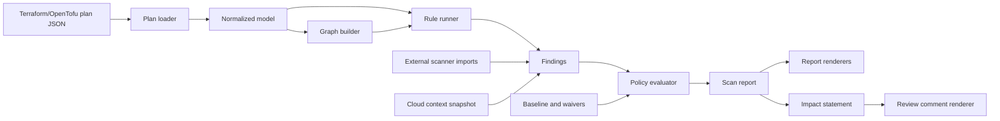

# Architecture

ChangeGate is organized around one path: read plan JSON, normalize it, build graph context, evaluate rules, evaluate policy, render deterministic output.

## Major Components

| Component | Role |
| --- | --- |
| Plan ingestion | Reads Terraform/OpenTofu JSON plans and redacts sensitive values before analysis. |
| Normalized model | Represents changed resources, actions, evidence, findings, and deploy decisions consistently across output formats. |
| Graph analysis | Builds resource relationships used for exposure, blast-radius, and attack-path reasoning. |
| Rule evaluation | Applies built-in AWS rules and optional custom YAML/Rego policies. |
| Policy evaluation | Converts findings, baselines, waivers, and confidence thresholds into allow, warn, block, or manual-review outcomes. |
| Review Intelligence | Produces Security Impact Statements, PR/MR comments, graph evidence, and attack-path summaries. |
| Output rendering | Emits console, JSON, Markdown, SARIF, JUnit, GitHub, GitLab, visualization, and audit-bundle artifacts. |

## Determinism

Reports are stable for the same inputs. Findings, rules, graph edges, archive members, and generated artifacts are sorted before rendering.

## Security Boundaries

The default scan path is offline. Optional cloud context is file-based. Custom Rego rejects network/runtime builtins and runs with timeout and input-size limits.
