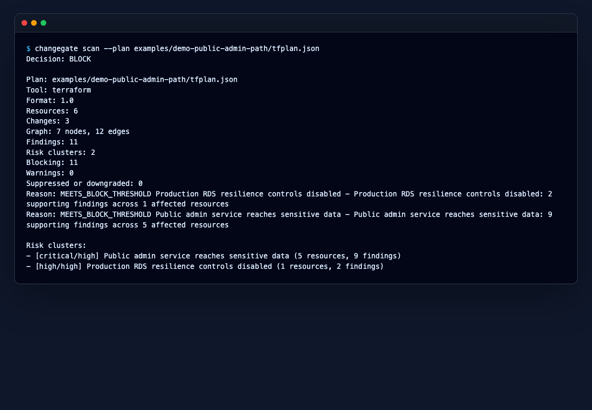
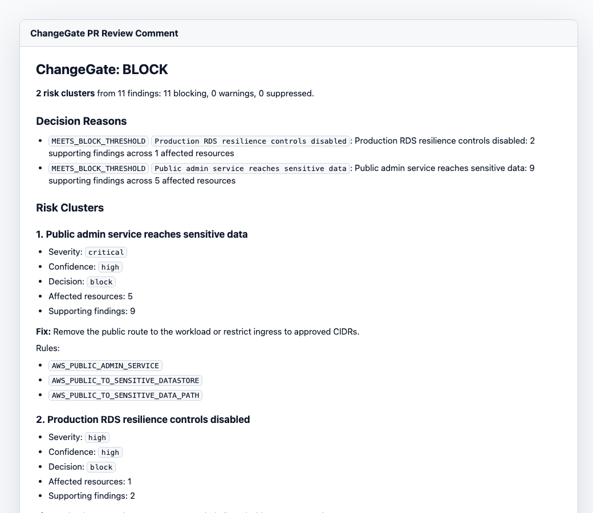
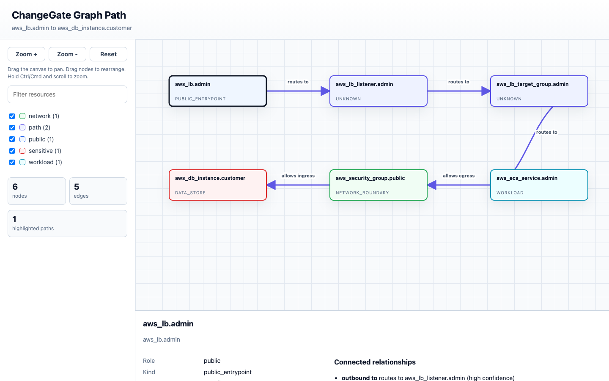
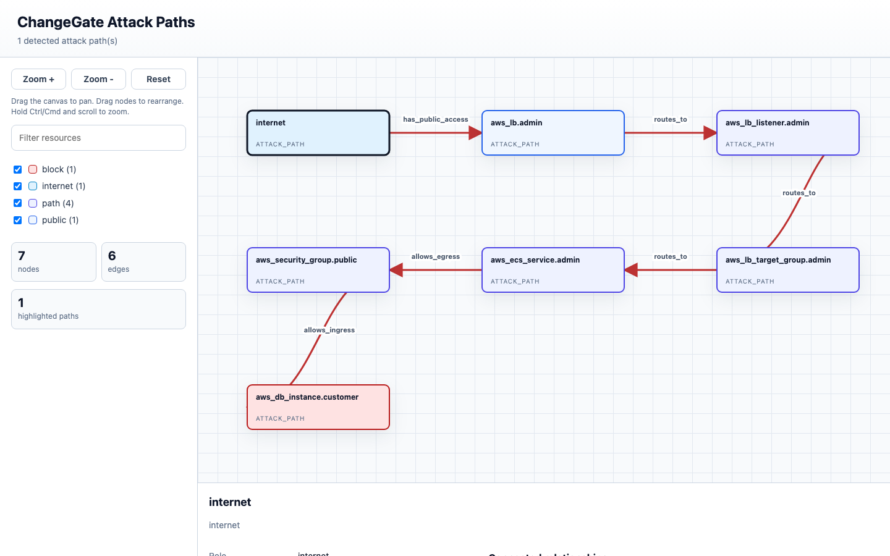

# Validation Matrix

This page describes the ChangeGate scenarios that can be validated from the public repository without cloud credentials. The fixtures are sanitized and deterministic, so they are useful for evaluating behavior, reproducing reports, and checking CI integration before scanning private infrastructure plans.

## Runnable Scenarios

| Scenario                  | Command                                                                                                                                                       | Expected Decision | Runtime                         | What This Validates                                                                                                                               |
| ------------------------- | ------------------------------------------------------------------------------------------------------------------------------------------------------------- | ----------------- | ------------------------------- | ------------------------------------------------------------------------------------------------------------------------------------------------- |
| Public admin path demo    | `changegate scan --plan examples/demo-public-admin-path/tfplan.json`                                                                                          | `BLOCK`           | local fixture                   | Cluster-first scan output, public entrypoint to admin workload to customer RDS path, topology-focused remediation, and stable blocking exit code. |
| Security Impact Statement | `changegate impact --plan examples/demo-public-admin-path/tfplan.json --format markdown`                                                                      | `BLOCK`           | local fixture                   | Review-ready deployment summary, risk clusters, risk movement, and required reviewer routing.                                                     |
| Attack-path evidence      | `changegate attack-paths --plan examples/demo-public-admin-path/tfplan.json --format markdown`                                                                | `block` path      | local fixture                   | Deterministic public-to-sensitive attack path evidence with graph steps and affected resources.                                                   |
| Graph path visualization  | `changegate graph visualize --plan examples/demo-public-admin-path/tfplan.json --view path --from aws_lb.admin --to aws_db_instance.customer --out path.html` | visual artifact   | local fixture                   | Self-contained HTML graph output for review packets and pull request artifacts.                                                                   |
| Risk-test corpus          | `changegate test examples/risk-tests`                                                                                                                         | test pass/fail    | local fixtures                  | Module-style regression tests for expected allow, warn, and block outcomes.                                                                       |
| Baseline adoption         | `changegate scan --plan tfplan.json --baseline .changegate/baseline.json --new-only`                                                                          | policy-dependent  | local fixture or user plan      | New-risk-only enforcement so you can adopt ChangeGate without fixing every existing risk on day one.                                              |
| Waiver governance         | `changegate scan --plan tfplan.json --policy .changegate.yaml`                                                                                                | policy-dependent  | local fixture or user plan      | Expiring waiver behavior, scoped suppressions, and waiver evidence in reports.                                                                    |
| External scanner import   | `changegate scan --plan tfplan.json --import-sarif scanner.sarif`                                                                                             | policy-dependent  | local fixture or user artifacts | Adapter normalization for existing SARIF, Checkov, Trivy, KICS, Grype, and generic JSON findings.                                                 |
| Cloud-context file scan   | `changegate scan --plan tfplan.json --context-file aws-context.json`                                                                                          | policy-dependent  | offline snapshot                | Offline enrichment behavior after a snapshot has been collected and reviewed.                                                                     |

## Public Demo

The [public admin path demo](../examples/demo-public-admin-path) uses a sanitized Terraform plan fixture that models:

```text
internet -> public ALB -> listener -> target group -> admin ECS service -> security group -> customer RDS
```

The demo includes pre-generated artifacts in [examples/demo-public-admin-path/outputs](../examples/demo-public-admin-path/outputs):

- Markdown scan report with risk clusters and finding details.
- Security Impact Statement.
- PR/MR comment body.
- Attack-path evidence.
- Mermaid, SVG, and self-contained HTML graph visualizations.

## Visual Examples

These screenshots show the main review surfaces produced from sanitized fixtures.









## Risk-Test Corpus

The [examples/risk-tests](../examples/risk-tests) corpus contains executable fixtures for common ChangeGate behavior:

```bash
changegate test examples/risk-tests
```

The corpus covers expected public web exposure, blocked public admin exposure, public-to-sensitive paths, Lambda URL to secret paths, IAM escalation paths, baseline behavior, waiver scoping, and cloud-context severity changes.

## Behavior Boundaries

ChangeGate favors high-confidence blocking. Ambiguous graph evidence, incomplete IAM context, unclear cloud context, or mixed policy signals should produce warning-oriented output rather than surprising deployment blocks.

The repository fixtures are sanitized and deterministic. They are intended for repeatable behavior checks, CI smoke tests, and user education.

## Local Checks

When building ChangeGate from source, these commands provide a quick local check:

```bash
go test ./...
go test -race ./...
changegate test examples/risk-tests
```

For CI setup and output artifacts, see [GitHub Actions](github-actions.md), [GitLab CI](gitlab-ci.md), [Output formats](output-formats.md), and [Audit evidence](audit-compliance.md).
